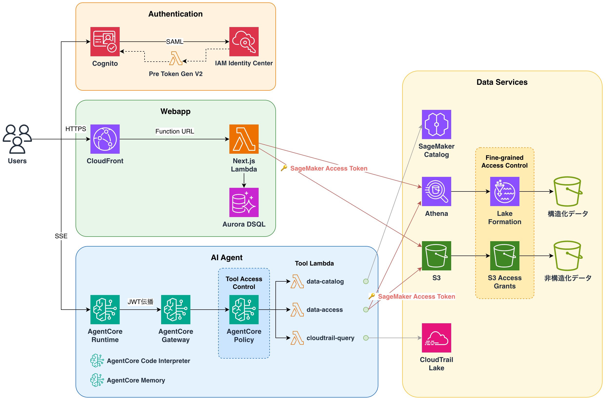

# Sample SageMaker Agentic Analyst

SageMaker Unified Studio (SMUS) で設定したFine-grained Access Control (FGAC) が、AIエージェント経由のデータアクセスにも透過的に適用されることを実証するデモアプリケーション。

## 概要

このプロジェクトは、以下の2つの方法でFGACが適用されたデータにアクセスできることを検証します：

1. **Webアプリからの直接クエリ** - Athena経由でSQLクエリを実行
2. **AIエージェント経由のアクセス** - Bedrock AgentCore上のエージェントがユーザー権限に応じたデータアクセスを実行

### アーキテクチャ



| 機能                               | 用途                                           |
| ---------------------------------- | ---------------------------------------------- |
| SageMaker Catalog                  | データカタログ検索・スキーマ取得               |
| Lake Formation                     | テーブル・行・列レベルのアクセス制御           |
| S3 Access Grants                   | ファイルレベルのアクセス制御                   |
| Bedrock AgentCore Runtime          | AIエージェントのホスティング                   |
| Bedrock AgentCore Memory           | チャット履歴（メッセージ本文）保存             |
| Bedrock AgentCore Code Interpreter | サンドボックス環境でのコード実行・データ可視化 |
| Aurora DSQL                        | セッションメタデータ保存                       |
| CloudTrail Lake                    | 監査ログ検索                                   |

詳細は [design/data-access-control.md](design/data-access-control.md) を参照。

## 前提条件

- 組織のIAM Identity Centerインスタンス（アカウントレベルでは不可）
- デプロイリージョン = IdCホームリージョン（DataZoneは異なるリージョンのIdCインスタンスを参照できない）
- Node.js >= v20
- pnpm >= 10
- AWS CLI v2
- jq

## セットアップ手順

以下の順序で実行してください:

| ステップ | ドキュメント                                          | 内容                                                 | 対象ペルソナ                         |
| -------- | ----------------------------------------------------- | ---------------------------------------------------- | ------------------------------------ |
| 1        | [01-deployment.md](docs/01-deployment.md)             | IdC前提条件、CDKデプロイ、SMUSドメイン作成、SAML設定 | 開発者                               |
| 2        | [02-sagemaker-config.md](docs/02-sagemaker-config.md) | SMUSプロジェクト設定、データ準備、FGAC設定           | インフラ管理者、データプロデューサー |
| 3        | [03-e2e-testing.md](docs/03-e2e-testing.md)           | E2E検証シナリオ                                      | 全ペルソナ                           |

## 運用上の制約

データプロデューサー・コンシューマーが意識すべき制約です。

### S3アセットの作成方法

S3アセットはSMUSのUI経由で作成してください。DataZone API（`create-asset`）で作成するとSMUSのUIに表示されず、Publish/Shareができません。正しい手順: S3ロケーション追加 → データソース実行。

### サインアウト時の注意

IdCはSAML Single Logoutをサポートしません。Webアプリからサインアウトしても、IdCセッション（最大90日）は残り続け、再ログイン時に前のユーザーで自動認証されます。**別のユーザーに切り替える場合は、IdCポータル（`{instance}.awsapps.com/start`）からもサインアウトしてください。**

### 初回ログインの必要性

IdCユーザーがSMUSドメインに初めてアクセスする前は、ユーザーステータスが `ASSIGNED`（未有効化）です。この状態では `RedeemAccessToken` が `403 User is not activated` で失敗し、AIエージェント経由のデータアクセスができません。**各ユーザーは、エージェント利用前にSMUS（`https://dzd-xxx.sagemaker.<region>.on.aws/`）に一度ログインしてステータスを `ACTIVATED` にする必要があります。**

### 外部S3バケットのデータレイクロケーション登録

CDKで作成した外部S3バケットをAthenaクエリの対象にする場合、`lakeformation register-resource` でデータレイクロケーションとして登録が必要です。未登録だとLake FormationがS3アクセスを仲介できず `PERMISSION_DENIED` になります。SMUSが自動作成するSageMaker管理バケットは自動登録されるため、この手順は外部バケットのみ必要です。

## デモシナリオ

### データコンシューマー（営業分析）

```
「先月の店舗別売上トップ10を教えて」
→ AIエージェントがathena_query toolで検索
→ Lake Formationが権限を評価し、許可されたデータのみ返却
```

### データプロデューサー（機密データアクセス）

```
「営業担当者の成績評価レポートを作成して」
→ データコンシューマーには見えない機密データにアクセス可能
```

### ドメイン管理者（セキュリティ監査）

```
「過去24時間のS3アクセスログで異常なパターンを検出して」
→ cloudtrail_query toolでCloudTrail Lakeを検索
→ ビジネスデータへのアクセスは拒否（職務分離）
```

### Subscription管理（エージェント経由）

```
データコンシューマー: 「sales_rep_performance テーブルへのアクセスをリクエストして」
→ subscription_request toolでSubscription Request送信

データプロデューサー: 「受信したリクエストを確認して、承認して」
→ subscription_list_requests → subscription_approve
→ SMUS UIと等価な操作をエージェント経由で実現
```

## コスト

50ユーザー（DAU 50人、1人あたり10回/日）、100テーブルの場合の月額試算（ap-northeast-1）:

| サービス                           | 用途                             | 月額 [USD] |
| ---------------------------------- | -------------------------------- | ---------- |
| Amazon Bedrock                     | LLM推論（Claude Sonnet 4.6）     | 420.0      |
| Bedrock AgentCore Runtime + Lambda | エージェント・webapp・ツール実行 | 4.4        |
| SageMaker Catalog                  | データガバナンス・カタログ管理   | 3.7        |
| Amazon Athena                      | SQLクエリ実行                    | 0.3        |
| AWS CloudTrail Lake                | 監査ログ検索                     | 3.8        |
| Amazon CloudFront + S3             | フロントエンド配信 + データ保管  | 0.8        |
| その他                             | KMS, CloudWatch, ECR, Cognito    | 4.3        |
| **合計**                           |                                  | **~437**   |

詳細な前提条件は [design/cost-estimate.md](design/cost-estimate.md) を参照

## ドキュメント

### 開発ガイド

| ドキュメント           | 内容                     | 対象読者               |
| ---------------------- | ------------------------ | ---------------------- |
| [AGENTS.md](AGENTS.md) | 開発規約、コマンド、運用 | AIエージェント、開発者 |

### 設計ドキュメント（design/）

| ドキュメント                                            | 内容                               |
| ------------------------------------------------------- | ---------------------------------- |
| [requirements.md](design/requirements.md)               | 要求定義書                         |
| [data-access-control.md](design/data-access-control.md) | データアクセス制御のアーキテクチャ |

## Security

See [CONTRIBUTING](CONTRIBUTING.md#security-issue-notifications) for more information.

## License

This library is licensed under the MIT-0 License. See the [LICENSE](LICENSE) file.
