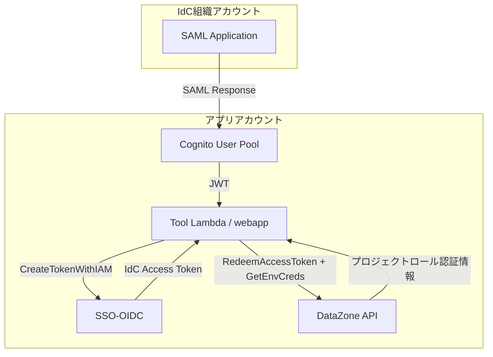
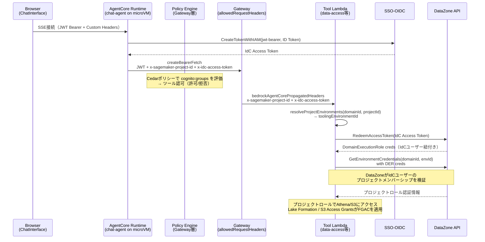

# データアクセス制御

## 概要

本ドキュメントは、webappへの認証からFGACが適用されたデータアクセスまでの統合的なフローを記述する。

**SSoT**: [requirements.md](./requirements.md)

## 三層アーキテクチャモデル

このシステムは以下の三層で構成される。

| 層      | 名称                                        | 役割                                                                                                            | API例                                                                |
| ------- | ------------------------------------------- | --------------------------------------------------------------------------------------------------------------- | -------------------------------------------------------------------- |
| Layer 1 | ガバナンス層（SMUS / DataZone）             | 権限の事前設定。Subscription承認時にLF/S3AGの権限を自動設定                                                     | CreateAsset, CreateSubscriptionRequest等（Lambdaからは原則呼ばない） |
| Layer 2 | 認可層（Lake Formation / S3 Access Grants） | 「誰がどのデータにアクセスできるか」の管理。クエリ実行時にAthena/S3から透過的に呼ばれる。Lambdaから直接呼ばない | —                                                                    |
| Layer 3 | 実行層（Athena API / S3 API）               | Lambdaが直接呼ぶ層                                                                                              | StartQueryExecution, GetDataAccess + GetObject                       |

**重要な原則:**

- DataZoneはカタログ・ガバナンスツールであり、**クエリ実行APIを持たない**
- DataZoneがやることはSubscription承認時のLFパーミッション設定だけであり、その後のデータアクセスフローには完全に不在
- `GetEnvironmentCredentials` はLayer 1のAPIだが、プロジェクトロールの認証情報取得（Layer 3の前段）として使用する

### FGAC権限の設定原則

- Lake FormationとS3 Access Grantsの権限はSMUSのPublish/Subscribe機能経由で自動設定される
- CloudTrail LakeへのアクセスはPolicy Engine（Cedarポリシー）のツール認可で制御

### FGACを侵害する操作

以下の操作はSMUSのFGAC管理と競合し、権限の不整合を引き起こす:

| 禁止操作                                                                  | 理由                                                                                                                                        |
| ------------------------------------------------------------------------- | ------------------------------------------------------------------------------------------------------------------------------------------- |
| `aws lakeformation grant-permissions` による手動権限付与                  | SMUSのPub/Subが管理するLF権限と競合する                                                                                                     |
| `aws s3control create-access-grant` による手動Grant作成                   | SMUSが自動作成するIAMタイプGrantと競合する                                                                                                  |
| IdCユーザーへの直接的なLF権限付与（`identitystore:::user/` プリンシパル） | プロジェクトロール経由のFGACモデルと矛盾する                                                                                                |
| `DIRECTORY_USER` タイプのS3 Access Grants作成                             | TIPは使用しない。プロジェクトロール経由のIAMタイプGrantのみ                                                                                 |
| Lambda実行ロールで直接 `GetEnvironmentCredentials` を呼ぶ                 | 全ユーザーが同一プロジェクトロールを取得しFGACが無効化される。`RedeemAccessToken`で取得したDER認証情報（IdCユーザー紐付き）で呼ぶ必要がある |
| IAM Roleのみ（LF管理外）でAthenaクエリ                                    | 全ユーザーが同一権限になる。プロジェクトロールで実行すること                                                                                |
| `CfnDataLakeSettings` をCDKで管理                                         | SMUSが動的に追加するロール（`AmazonSageMakerManageAccess-*`等）と競合する                                                                   |
| Workgroup名や`AccountId`を環境変数でハードコード                          | `GetEnvironment`のレスポンスから動的に取得すべき                                                                                            |
| DataZone APIをクエリ実行パスに含める                                      | DataZoneはカタログ・ガバナンスツール。`GetEnvironmentCredentials`はプロジェクトロール取得用であり、クエリ実行APIではない                    |

**権限はすべてSMUSのPublish/Subscribe機能経由で設定する。**

### S3 Access Grants自動作成の必須条件（Project Role方式）

SMUSのPub/SubでSubscriberにS3 Access Grantが自動作成されるには、以下がすべて必要:

1. プロジェクトロールにS3バケットアクセス権限（`s3:GetObject`, `s3:ListBucket`）
2. S3AG Location管理権限（`s3:CreateAccessGrantsLocation`, `s3:CreateAccessGrant`等）
3. `s3:TagResource` / `s3:ListTagsForResource` 権限（`s3:*AccessGrant*` ワイルドカードではカバーされない）
4. SMUSのUIでS3ロケーションをAccess Role空で追加 → SMUSがS3AG Locationを自動作成
5. Publish → Share → Subscription Grant → S3 Access Grant自動作成

### S3 Object Collectionの「managed asset」条件

[公式ドキュメント](https://docs.aws.amazon.com/sagemaker-unified-studio/latest/userguide/grant-access-to-unmanaged-asset.html)ではmanaged assetは「LF-managed Glue tablesとRedshift tables/views」のみ。S3 Object Collectionがmanagedになるには、Project Role方式でS3ロケーションを追加し、SMUSがS3AG Locationを自動作成・紐付けする必要がある。

---

## 認証基盤の構成

IdCはWebアプリ向けOIDCをサポートしない（Device Authorization Grant（CLI用）のみ）。そのためCognitoをSP、IdCをIdPとしてSAML連携する。

### IdC SAML連携の制約

- **IdC SAML属性マッピングでグループ送信不可**: `${user:groups}` を指定してもSAMLアサーションにグループ情報が含まれない。Pre Token Generation V2 LambdaがIdC APIを呼び出し、`cognito:groups`クレームに埋め込む方式で回避している
- **IdP-initiated SSO制約**: IdCポータルからアプリを開くには、SAML Applicationに`RelayState`の設定が必要



## データアクセスパターン

### RedeemAccessToken → GetEnvironmentCredentials方式

**用途**: エンドユーザーのIdCアイデンティティに基づくプロジェクトロールを取得し、SMUS Pub/Subで設定されたFGACを適用する。構造化データ（Athena）と非構造化データ（S3 Access Grants）の両方に対応。

#### なぜRedeemAccessTokenか — サーバーサイドアプリからの使い方

RedeemAccessTokenは公開ドキュメント上ではJDBC接続（Athena JDBCドライバ）の文脈でのみ説明されている（[Analyze subscribed data via JDBC](https://docs.aws.amazon.com/datazone/latest/userguide/query-with-jdbc.html)）。しかし、**Cognito + IdC SAML連携のサーバーサイドアプリ（Lambda等）からRedeemAccessTokenを直接呼び出してプロジェクトロールを取得する**パターンは、公開ドキュメントに記載がない。

このパターンが必要な理由:

- GetEnvironmentCredentialsは、呼び出し元IAMプリンシパルのメンバーシップで認可する。TIP [identity-enhanced session](https://docs.aws.amazon.com/singlesignon/latest/userguide/trustedidentitypropagation-identity-enhanced-iam-role-sessions.html)の`sts:identity_context`は評価されない（実機検証済み）
- Lambda実行ロールを全プロジェクトのメンバーに登録する方式では、ユーザー単位のFGACが適用されない
- RedeemAccessTokenはIdC Access TokenからDomainExecutionRole認証情報を返し、この認証情報にはIdCユーザーのアイデンティティが紐付いている。この認証情報でGetEnvironmentCredentialsを呼ぶと、**IdCユーザーの**メンバーシップに基づいてプロジェクトロールが返される

サーバーサイドアプリからの利用手順:

1. Cognito ID Tokenを`CreateTokenWithIAM`（jwt-bearer grant）でIdC Access Tokenに変換する。OAuth CMAに`datazone:domain:access`スコープが必要（[IdC UG: Access scopes](https://docs.aws.amazon.com/singlesignon/latest/userguide/customermanagedapps-saml2-oauth2.html#scopes-oidc)）
2. IdC Access Tokenを`POST /sso/redeem-token`に渡してDomainExecutionRole認証情報を取得する。SigV4署名は不要（認証なしのHTTP POST）
3. DER認証情報でDataZoneClientを初期化し、`GetEnvironmentCredentials`を呼ぶ

**3段階の認証情報変換:**

| Step | API                               | 入力                      | 出力                      | 目的                                                        | 実行場所    |
| ---- | --------------------------------- | ------------------------- | ------------------------- | ----------------------------------------------------------- | ----------- |
| 1    | `CreateTokenWithIAM` (jwt-bearer) | Cognito ID Token          | IdC Access Token          | CognitoユーザーをIdCユーザーに変換                          | chat-agent  |
| 2    | `RedeemAccessToken`               | IdC Access Token          | DomainExecutionRole creds | IdCユーザーのアイデンティティが紐付いたDER認証情報を取得    | Tool Lambda |
| 3    | `GetEnvironmentCredentials`       | DER creds + environmentId | プロジェクトロール creds  | IdCユーザーのメンバーシップに基づくプロジェクトロールを取得 | Tool Lambda |

> **注**: Step 1 を chat-agent に一元化することで、同一 `jti` の ID Token が複数の Tool Lambda で消費される問題を解消した。IdC Access Token は `x-idc-access-token` ヘッダーで Gateway 経由で Tool Lambda に伝播される。`RedeemAccessToken` には jti 制約がないため、並列ツール呼び出しでも問題ない。

**重要な制約:**

- `CreateTokenWithIAM`の`jwt-bearer`グラントは同一`jti`のID Tokenを再利用できない。`fetchAuthSession({ forceRefresh: true })`で毎回新しいトークンを取得する必要がある
- `RedeemAccessToken`のレスポンスの`expiration`は文字列で返るため、SDKに渡す前に`new Date()`で変換が必要

```typescript
async function queryAthenaWithProjectRole(domainId: string, environmentId: string, query: string): Promise<Row[]> {
  // Step 1: Cognito ID Token → IdC Access Token
  const idcToken = await createTokenWithIAM(cognitoIdToken);

  // Step 2: IdC Access Token → DomainExecutionRole creds
  const derCreds = await redeemAccessToken(domainId, idcToken);

  // Step 3: DER creds → プロジェクトロール creds
  const envCreds = await new DataZoneClient({
    region,
    credentials: derCreds,
  }).send(
    new GetEnvironmentCredentialsCommand({
      domainIdentifier: domainId,
      environmentIdentifier: environmentId,
    }),
  );

  // Step 4: プロジェクトロールでAthenaクエリを実行
  const athena = new AthenaClient({
    credentials: {
      accessKeyId: envCreds.accessKeyId!,
      secretAccessKey: envCreds.secretAccessKey!,
      sessionToken: envCreds.sessionToken!,
    },
  });

  const execResponse = await athena.send(
    new StartQueryExecutionCommand({
      QueryString: query,
      WorkGroup: workgroup, // SMUSが自動作成した標準Workgroup
      QueryExecutionContext: { Database: database },
    }),
  );
  // ... 結果取得
}
```

**前提設定:** SMUS設定・S3コネクション設定は [02-sagemaker-config.md](../docs/02-sagemaker-config.md)、IdC OAuth CMA設定は [01-deployment.md Phase 4.6](../docs/01-deployment.md) を参照。

**Tool Lambda / webapp IAM権限:**

- `datazone:GetEnvironment`, `datazone:ListEnvironments`（環境情報取得）
- `datazone:ListConnections`, `datazone:GetConnection`（S3コネクション解決用）
- `datazone:ListProjects`（ドメイン横断コネクション検索用）

**chat-agent（AgentCore Runtime）IAM権限:**

- `sso-oauth:CreateTokenWithIAM`（Cognito ID Token → IdC Access Token変換）

**webapp IAM権限（追加）:**

- `sso-oauth:CreateTokenWithIAM`（webapp直接クエリ用。chat-agent経由ではなくwebapp自身がStep 1を実行）

### セキュリティ: 認可のDataZone移譲

**AIエージェント経由（Tool Lambda）** と **webapp直接クエリ（Webapp Lambda `/api/query`）** の両方で同じRedeemAccessTokenフローを使用する。いずれもLambda実行ロールのプロジェクトメンバーシップは不要 — 認可はDataZoneに移譲する。webapp側では追加でメンバーシップ検証を行う（defense in depth）。

以下はAIエージェント経由のエンドツーエンドフロー。webapp直接クエリも TL 以降は同一（Cognito ID Tokenの取得元がカスタムヘッダーではなく `getSession(forceRefresh: true)` になる点のみ異なる）。



### プロジェクト一覧取得の認可

`/api/projects` はCognitoセッションのemailからIdentity Store `ListUsers` でIdCユーザーIDを解決し、`ListProjects(userIdentifier)` でユーザーが所属するプロジェクトのみを取得する。`datazone-auth`パッケージの `resolveIdcUserIdByEmail` と同一のemail→短縮名フォールバックロジックを使用。RedeemAccessTokenフローは不要（Lambda実行ロールでDataZone APIを呼び出し、`userIdentifier` でフィルタリング）。

### S3アクセスフロー

外部バケットへのアクセス方式はPublisher/Subscriberで異なる。Publisherは直接S3アクセス、SubscriberはS3 Access Grants経由。参考: [S3 Access Grants and corporate directory identities](https://docs.aws.amazon.com/AmazonS3/latest/userguide/access-grants-directory-ids.html)

| シナリオ                                 | アクセス方式                                      | 理由                                                                                                                                                                                                                            |
| ---------------------------------------- | ------------------------------------------------- | ------------------------------------------------------------------------------------------------------------------------------------------------------------------------------------------------------------------------------- |
| ドメインバケット（Publisher/Subscriber） | 直接 `GetObject`                                  | `AccessDomainS3BucketPermissions` IAMポリシー（プロジェクトプレフィックス配下のみ）                                                                                                                                             |
| 外部バケット（Publisher）                | 直接 `GetObject`                                  | Project Role方式の前提条件として手動付与した`S3BucketAccess`インラインポリシーにより直接S3アクセスが可能。Publisherプロジェクトロール自身への明示的なS3AG Grantは存在せず、`GetDataAccess`は失敗する（実機検証済み 2026-03-04） |
| 外部バケット（Subscriber）               | S3 Access Grants（`GetDataAccess` → `GetObject`） | SMUSのPub/SubがSubscriberロールに対してIAMタイプのGrantを自動作成                                                                                                                                                               |

**判断方法:** コネクションの `accessRole` の有無とプロジェクトの所有関係で判断する。プロジェクトレベルのコネクションでは `accessRole` があれば S3 Access Grants 経由、なければ直接アクセス。ドメインレベルで解決されたコネクション（Subscriber）は S3 Access Grants を強制する。

```typescript
// Subscriberの場合: GetEnvironmentCredentials → GetDataAccess → GetObject
async function readS3ViaAccessGrants(domainId: string, envId: string, s3Uri: string): Promise<string> {
  // Step 1: プロジェクトロール認証情報を取得
  const creds = await datazone.send(
    new GetEnvironmentCredentialsCommand({
      domainIdentifier: domainId,
      environmentIdentifier: envId,
    }),
  );

  // Step 2: S3 Access Grantsで一時認証情報を取得
  const s3Control = new S3ControlClient({ credentials: toCredentials(creds) });
  const dataAccess = await s3Control.send(
    new GetDataAccessCommand({
      AccountId: accountId,
      Target: s3Uri,
      Permission: 'READ',
    }),
  );

  // Step 3: 一時認証情報でファイル取得
  const s3 = new S3Client({
    credentials: toCredentials(dataAccess.Credentials),
  });
  const obj = await s3.send(new GetObjectCommand({ Bucket: bucket, Key: key }));
  return await obj.Body!.transformToString();
}
```

### glueDBNameの動的解決

各プロジェクトのLakehouse DB環境が自動作成する `glue_db_{lakehouseEnvId}` を使用する。このデータベースの個別テーブルには `IAMAllowedPrincipals` の `SELECT` 権限が付与されていないため、Lake Formationの明示的な権限付与が必須となり、行・列レベルのFGACが正しく適用される。アクセス制御はPublisher/Subscriberで異なる:

- **Publisher**: `glue_db_*` に直接作成した実テーブルが存在する。SMUSがプロジェクト作成時に条件付き `IAMPrincipals` の `SELECT` 権限（`context.datazone.projectId` 条件）を ALL_TABLES に自動付与するため、自己Subscribeなしでクエリ可能
- **Subscriber**: `glue_db_*` にはSubscribeされたテーブルのリソースリンク（元テーブルへのポインタ）のみが存在し、未共有テーブルは `TABLE_NOT_FOUND` となる
- **行・列レベル**: SMUSのSubscription承認時に設定された行フィルタ・列制限がLake Formation権限としてプロジェクトロールに付与され、`SELECT` 時に適用される

### Lake Formation権限モデル

#### Lake Formationの制約

- IdCユーザー/グループはデータレイク管理者になれない（IAMロール/ユーザーのみ）

#### アクセス判定のAND条件

```
アクセス許可 = IAM ポリシーが許可
              AND
              LF パーミッションが許可（または IAMAllowedPrincipals:Super が付いている）
```

#### LFの適用範囲

| アクセスパス                             | LF対象                             |
| ---------------------------------------- | ---------------------------------- |
| Athena → Glue Catalog → S3（LF登録済み） | ✅                                 |
| SDK/CLI → S3直接アクセス                 | ❌（S3バケットポリシー + IAMのみ） |

## AgentCore OAuth統合 API仕様

ツール認可はPolicy Engine（Cedarポリシー）がGateway層でJWTの`cedar_groups`カスタムクレームに基づいて行う。Pre Token Generation LambdaがIdCグループを`"|group1|group2|"`形式の区切り文字付き文字列として埋め込み、Cedarポリシーが`like "*|{group}|*"`パターンで完全一致照合する。

### エンドポイント

```
POST https://bedrock-agentcore.{REGION}.amazonaws.com/runtimes/{ESCAPED_AGENT_ARN}/invocations?qualifier=DEFAULT
```

### リクエストヘッダー

| ヘッダー                                                       | 値                              | 説明                              |
| -------------------------------------------------------------- | ------------------------------- | --------------------------------- |
| `Authorization`                                                | `Bearer {COGNITO_ACCESS_TOKEN}` | OAuth認証用                       |
| `Content-Type`                                                 | `application/json`              |                                   |
| `Accept`                                                       | `text/event-stream`             | SSEストリーム受信用               |
| `X-Amzn-Bedrock-AgentCore-Runtime-Session-Id`                  | `{SESSION_ID}`                  | セッション管理用ID                |
| `X-Amzn-Bedrock-AgentCore-Runtime-Custom-Sagemaker-Project-Id` | `{PROJECT_ID}`                  | SMUSプロジェクトID                |
| `X-Amzn-Bedrock-AgentCore-Runtime-Custom-Cognito-Id-Token`     | `{COGNITO_ID_TOKEN}`            | RedeemAccessTokenフロー用ID Token |

### Runtime URLの取得

Runtime URLはサーバーサイドの `/api/cognito-token` API経由で取得する（環境変数 `AGENTCORE_RUNTIME_ARN` をクライアントに直接公開しないため）。

### Gateway JWT認証

GatewayのInbound認証はJWT（Cognito User Pool）。RuntimeがブラウザのCognito AccessTokenをGateway呼び出し時にBearerトークンとして伝播する。

**AccessTokenのクレーム:**

- `client_id`: Gateway `allowedClients` で検証
- `cognito:groups`: Pre Token Generation V2 LambdaがIdCグループを埋め込み。Policy Engineがツール認可に使用
